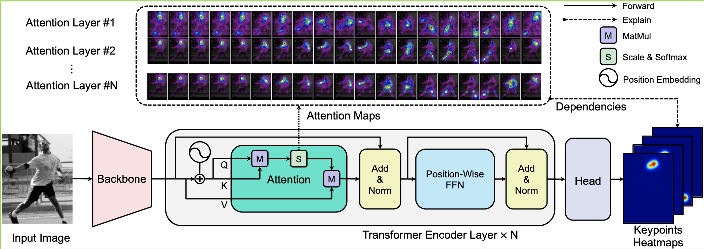
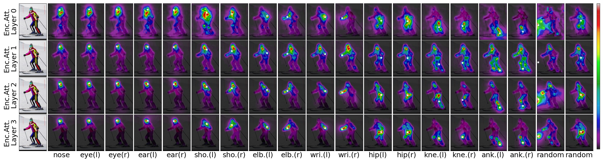
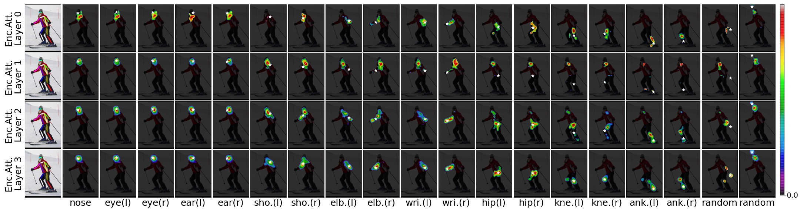
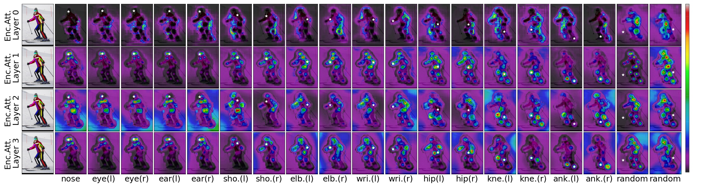
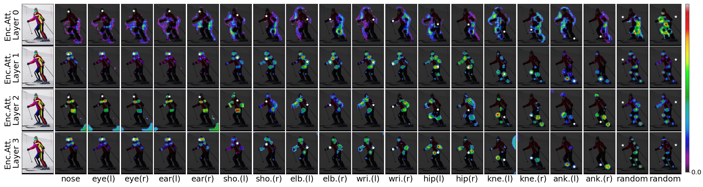

## Introduction

**[TransPose](https://arxiv.org/abs/2012.14214)** is a human pose estimation model based on a CNN feature extractor, a Transformer Encoder, and a prediction head. Given an image, the attention layers built in Transformer can capture long-range spatial relationships between keypoints and explain what dependencies the predicted keypoints locations highly rely on. 



[[arxiv 2012.14214]](https://arxiv.org/abs/2012.14214) [[paper]](https://arxiv.org/pdf/2012.14214.pdf) [[update]](https://github.com/yangsenius/TransPose/releases/download/paper/transpose.pdf) [[demo-jupyter-notebook]](demo.ipynb)

## Model Zoo

We choose two types of CNNs as the backbone candidates: ResNet and HRNet. The derived convolutional blocks are ResNet-Small, HRNet-Small-W32, and HRNet-Small-W48.

| Model          | Backbone    | #Attention layers |  d   |  h   | #Heads | #Params | AP (coco val gt bbox) | Download |
| -------------- | ----------- | :---------------: | :--: | :--: | :----: | :-----: | :-------------------: | :------: |
| TransPose-R-A3 | ResNet-S    |         3         | 256  | 1024 |   8    |  5.2Mb  |         73.8        | [model](https://github.com/yangsenius/TransPose/releases/download/Hub/tp_r_256x192_enc3_d256_h1024_mh8.pth) |
| TransPose-R-A4 | ResNet-S    |         4         | 256  | 1024 |   8    |  6.0Mb  |         75.1          | [model](https://github.com/yangsenius/TransPose/releases/download/Hub/tp_r_256x192_enc4_d256_h1024_mh8.pth) |
| TransPose-H-S  | HRNet-S-W32 |         4         |  64  | 128  |   1    |  8.0Mb  |         76.1          | [model](https://github.com/yangsenius/TransPose/releases/download/Hub/tp_h_32_256x192_enc4_d64_h128_mh1.pth) |
| TransPose-H-A4 | HRNet-S-W48 |         4         |  96  | 192  |   1    | 17.3Mb  |         77.5          | [model](https://github.com/yangsenius/TransPose/releases/download/Hub/tp_h_48_256x192_enc4_d96_h192_mh1.pth) |
| TransPose-H-A6 | HRNet-S-W48 |         6         |  96  | 192  |   1    | 17.5Mb  |         78.1          | [model](https://github.com/yangsenius/TransPose/releases/download/Hub/tp_h_48_256x192_enc6_d96_h192_mh1.pth) |

### Quick use

You can directly load TransPose-R-A4 or TransPose-H-A4 models with pretrained weights on COCO train2017 dataset from Torch Hub, simply by:

```python
import torch

tpr = torch.hub.load('yangsenius/TransPose:main', 'tpr_a4_256x192', pretrained=True)
```

### Results on COCO val2017 with detector having human AP of 56.4 on COCO val2017 dataset

|     Model      | Input size | FPS* | GFLOPs | AP    | Ap .5 | AP .75 | AP (M) | AP (L) |  AR   | AR .5 | AR .75 | AR (M) | AR (L) |
| :------------: | :--------: | :--: | :----: | ----- | ----- | :----: | :----: | :----: | :---: | :---: | :----: | :----: | :----: |
| TransPose-R-A3 |  256x192   | 141  |  8.0   | 0.717 | 0.889 | 0.788  | 0.680  | 0.786  | 0.771 | 0.930 | 0.836  | 0.727  | 0.835  |
| TransPose-R-A4 |  256x192   | 138  |  8.9   | 0.726 | 0.891 | 0.799  | 0.688  | 0.798  | 0.780 | 0.931 | 0.845  | 0.735  | 0.844  |
| TransPose-H-S  |  256x192   |  45  |  10.2  | 0.742 | 0.896 | 0.808  | 0.706  | 0.810  | 0.795 | 0.935 | 0.855  | 0.752  | 0.856  |
| TransPose-H-A4 |  256x192   |  41  |  17.5  | 0.753 | 0.900 | 0.818  | 0.717  | 0.821  | 0.803 | 0.939 | 0.861  | 0.761  | 0.865  |
| TransPose-H-A6 |  256x192   |  38  |  21.8  | 0.758 | 0.901 | 0.821  | 0.719  | 0.828  | 0.808 | 0.939 | 0.864  | 0.764  | 0.872  |

Note:

- we computed the average FPS* of testing 100 samples from coco val dataset (with batchsize=1) on a single NVIDIA 2080Ti GPU. The FPS may fluctuate up and down at different tests.
- We trained our different models on different hardware platforms: *1 x RTX2080Ti GPUs (TP-R-A4), 4 x TiTan XP GPUs (TP-H-S, TP-H-A4), and 4 x Tesla P40 GPUs (TP-H-A6)*.

### Results on COCO test-dev2017 with detector having human AP of 60.9 on COCO test-dev2017 dataset

| Model          | Input size | #Params | GFLOPs | AP    | Ap .5 | AP .75 | AP (M) | AP (L) | AR    | AR .5 | AR .75 | AR (M) | AR (L) |
| -------------- | ---------- | ------- | ------ | ----- | ----- | ------ | ------ | ------ | ----- | ----- | ------ | ------ | ------ |
| TransPose-H-S  | 256x192    | 8.0M    | 10.2   | 0.734 | 0.916 | 0.811  | 0.701  | 0.793  | 0.786 | 0.950 | 0.856  | 0.745  | 0.843  |
| TransPose-H-A4 | 256x192    | 17.3M   | 17.5   | 0.747 | 0.919 | 0.822  | 0.714  | 0.807  | 0.799 | 0.953 | 0.866  | 0.758  | 0.854  |
| TransPose-H-A6 | 256x192    | 17.5M   | 21.8   | 0.750 | 0.922 | 0.823  | 0.713  | 0.811  | 0.801 | 0.954 | 0.867  | 0.759  | 0.859  |

### Visualization

[Jupyter Notebook Demo](demo.ipynb)

Given an input image, a pretrained TransPose model, and the predicted locations, we can visualize the spatial dependencies of the predicted locations with threshold for the attention scores.

`TransPose-R-A4` with `threshold=0.00`


`TransPose-R-A4` with `threshold=0.01`


`TransPose-H-A4` with `threshold=0.00`


`TransPose-H-A4` with `threshold=0.00075`


## Getting started

### Installation

1. Clone this repository, and we'll call the directory that you cloned as ${POSE_ROOT}

   ```bash
   git clone https://github.com/yangsenius/TransPose.git
   ```

2. Install PyTorch>=1.6 and torchvision>=0.7 from the PyTorch [official website](https://pytorch.org/get-started/locally/)

3. Install package dependencies. Make sure the python environment >=3.7

   ```bash
   pip install -r requirements.txt
   ```

4. Make output (training models and files) and log (tensorboard log) directories under ${POSE_ROOT} & Make libs

   ```bash
   mkdir output log
   cd ${POSE_ROOT}/lib
   make
   ```

5. Download pretrained models from the [releases](https://github.com/yangsenius/TransPose/releases) of this repo to the specified directory

   ```txt
   ${POSE_ROOT}
    `-- models
        `-- pytorch
            |-- imagenet
            |   |-- hrnet_w32-36af842e.pth
            |   |-- hrnet_w48-8ef0771d.pth
            |   |-- resnet50-19c8e357.pth
            |-- transpose_coco
            |   |-- tp_r_256x192_enc3_d256_h1024_mh8.pth
            |   |-- tp_r_256x192_enc4_d256_h1024_mh8.pth
            |   |-- tp_h_32_256x192_enc4_d64_h128_mh1.pth
            |   |-- tp_h_48_256x192_enc4_d96_h192_mh1.pth
            |   |-- tp_h_48_256x192_enc6_d96_h192_mh1.pth    
   ```

### Data Preparation

We follow the steps of [HRNet](https://github.com/leoxiaobin/deep-high-resolution-net.pytorch#data-preparation) to prepare the COCO train/val/test dataset and the annotations. The detected person results are downloaded from [OneDrive](https://1drv.ms/f/s!AhIXJn_J-blWzzDXoz5BeFl8sWM-) or [GoogleDrive](https://drive.google.com/drive/folders/1fRUDNUDxe9fjqcRZ2bnF_TKMlO0nB_dk?usp=sharing). Please download or link them to ${POSE_ROOT}/data/coco/, and make them look like this:

```txt
${POSE_ROOT}/data/coco/
|-- annotations
|   |-- person_keypoints_train2017.json
|   `-- person_keypoints_val2017.json
|-- person_detection_results
|   |-- COCO_val2017_detections_AP_H_56_person.json
|   `-- COCO_test-dev2017_detections_AP_H_609_person.json
`-- images
	|-- train2017
	|   |-- 000000000009.jpg
	|   |-- ... 
	`-- val2017
		|-- 000000000139.jpg
		|-- ... 
```

### Traing & Testing

#### Testing on COCO val2017 dataset

```bash
python tools/test.py --cfg experiments/coco/transpose_r/TP_R_256x192_d256_h1024_enc4_mh8.yaml TEST.USE_GT_BBOX True
```

#### Training on COCO train2017 dataset

```bash
python tools/train.py --cfg experiments/coco/transpose_r/TP_R_256x192_d256_h1024_enc4_mh8.yaml
```

### Acknowledgements

Great thanks for these papers and their open-source codes：[HRNet](https://github.com/leoxiaobin/deep-high-resolution-net.pytorch),  [DETR](https://github.com/facebookresearch/detr),  [DarkPose](https://github.com/ilovepose/DarkPose)

### License

This repository is released under the [MIT LICENSE](https://github.com/yangsenius/TransPose/blob/main/LICENSE).

## Citation

If you find this repository useful please give it a star 🌟 or consider citing our work:

```tex
@article{yang2020transpose,
  title={TransPose: Towards Explainable Human Pose Estimation by Transformer},
  author={Yang, Sen and Quan, Zhibin and Nie, Mu and Yang, Wankou},
  journal={arXiv preprint arXiv:2012.14214},
  year={2020}
}
```
